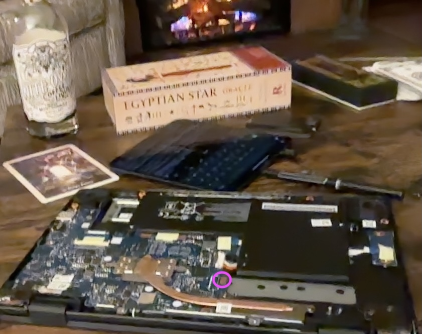
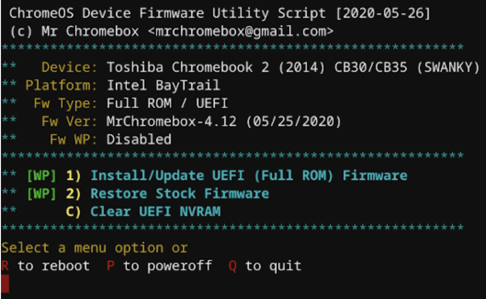

## rooting chromebooks

<br>

#### 🖤 don't brick, babe!

<br>

----

### 1. removing write-protected (wp) hardware locker

<br>

* figure out if your device is supported **[here](https://docs.mrchromebox.tech/docs/firmware/wp/disabling.html)**
* open up your chromebook
* locate and remove the WP pin on the firmware flash chip - this is how it looks like on acer series c0731:

<br>

<p align="center">

</p>

<br>

* close your chromebook

<br>

### 2. enable developer mode

<br>

* press `esc + refresh` keys, then press the power button to boot into recovery mode
* select "enable developer mode" and restart

<br>

### 3. enable linux/terminal

<br>

* **[on settings](https://support.google.com/chromebook/answer/9145439?hl=en)**

<br>

### 4. flash UEFI firmware

<br>

* open the terminal as root by pressing `ctrl + alt + f2` with `login chronos`
* install the full rom version of **[mrchromebox firmware](https://github.com/MrChromebox/scripts/blob/main/firmware.sh)**:

```shell
cd; curl -LOk mrchromebox.tech/firmware-util.sh && sudo bash firmware-util.sh
```

* choose `install UEFI (full rom) firmware`

 <br>

<p align="center">

</p>

<br>

### 5. boot your linux image from an  external drive

<br>

* have your favorite linux distro flashed in a driver
* recommendations are **[lubuntu](https://lubuntu.me/downloads/)** or **[galliumos](https://galliumos.org/)**
* use `ctrl-u` to boot from usb
* install your portable light linux and be free


